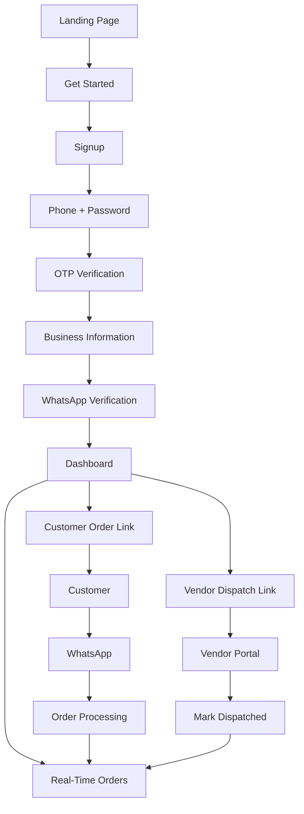

# Ennitant User Flow

## Notes

- n8n, Meta tokens, webhook URLs, and database IDs stay hidden from the UI.
- OTP codes are logged by the API when `OTP_DEV_MODE=true`.
- Customer page: `/order/{businessSlug}`
- Vendor page: `/vendor/{secureToken}`
